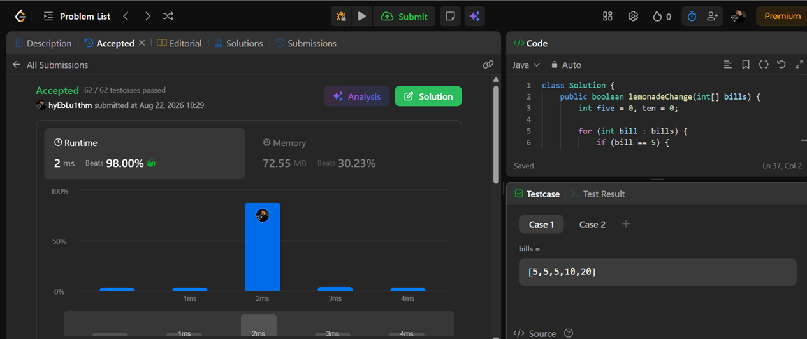
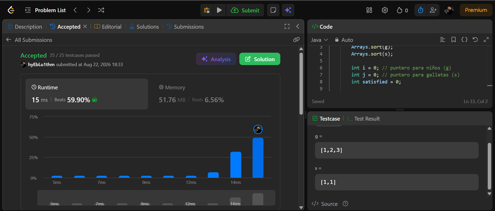

## 860. Lemonade Change

- Problema: https://leetcode.com/problems/lemonade-change/
- Código: [`lemonade-change/Solution.java`](lemonade-change/Solution.java)

**Criterio greedy:** en cada cliente se decide localmente con qué billetes dar
el cambio, priorizando gastar los billetes de $10 antes que los de $5. Un
billete de $5 sirve para dar cambio de $10 o de $20, mientras que uno de $10
solo sirve para dar cambio de $20; por eso conviene "reservar" los de $5 el
mayor tiempo posible. No hay retractación: una vez atendido un cliente, se
sigue con el siguiente sin deshacer nada.

- Paga con $5 → no se da cambio, se guarda el billete.
- Paga con $10 → se necesita un $5 de cambio; si no hay, `false`.
- Paga con $20 → se necesitan $15 de cambio: primero se intenta con un $10 +
  un $5 (gasta el billete que no sirve para más nada); si no se puede, se
  intenta con tres $5; si tampoco, `false`.

**Complejidad:**
- Tiempo: `O(n)` — una sola pasada sobre `bills`.
- Espacio: `O(1)` — solo dos contadores (`five`, `ten`).

---

## 455. Assign Cookies

- Problema: https://leetcode.com/problems/assign-cookies/
- Código: [`assign-cookies/Solution.java`](assign-cookies/Solution.java)

**Criterio greedy:** se ordenan `g` (gula de cada niño) y `s` (tamaño de cada
galleta) de menor a mayor y se recorren con dos punteros. En cada paso se
intenta satisfacer al niño **menos exigente** que quede con la galleta **más
pequeña disponible**. Si esa galleta no le alcanza, es demasiado chica para
cualquier niño restante (todos son más exigentes), así que se descarta y se
prueba con la siguiente galleta, más grande. Asignar la galleta más pequeña
que alcanza nunca perjudica el resultado óptimo, así que no hace falta
retractarse.

**Complejidad:**
- Tiempo: `O(n log n + m log m)` — dominado por ordenar `g` (tamaño n) y `s`
  (tamaño m); la pasada con dos punteros es `O(n + m)`.
- Espacio: `O(1)` adicional (sin contar el espacio interno del `sort`).

---
