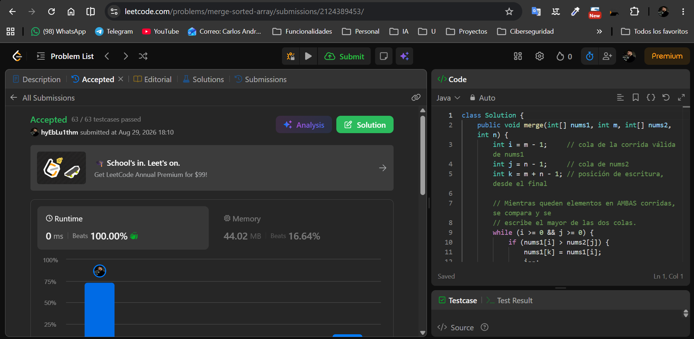
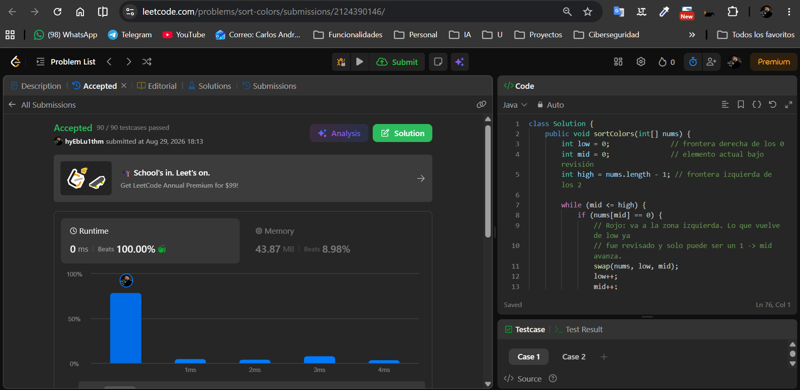

# Tarea 2 · Algoritmos de ordenamiento en LeetCode

Curso: Análisis de algoritmos · ITM · 2026-2
Tema: algoritmos de ordenamiento (fusión / counting · bandera holandesa)

Usuario de LeetCode: **`<hyEbLu1thm>`**

Lenguaje: Java.

---

## 88. Merge Sorted Array

- Problema: https://leetcode.com/problems/merge-sorted-array/
- Código: [`merge-sorted-array/Solution.java`](merge-sorted-array/Solution.java)

**Algoritmo: fusión (merge) desde el final, in-place.** Es la fase de *merge*
de Merge Sort sin la fase de división: ya llegan dos corridas ordenadas en no
decreciente (los primeros `m` valores de `nums1`, y los `n` valores de
`nums2`), así que solo falta intercalarlas. Se usan tres índices: `i = m-1`
(cola de `nums1`), `j = n-1` (cola de `nums2`) y `k = m+n-1` (posición de
escritura). En cada paso se compara la cola de cada corrida y se escribe el
**mayor** en `nums1[k]`; cuando una corrida se agota, se copia lo que queda de
la otra (si la que se agota es `nums2`, no hay nada que hacer: el resto de
`nums1` ya está en su lugar).

**Por qué se escribe desde el final:** fusionar hacia adelante pisaría valores
de `nums1` todavía no consumidos y obligaría a un arreglo auxiliar de tamaño
`m+n`. La cola de `nums1` (posiciones `m .. m+n-1`) es relleno descartable, y
son exactamente las `n` casillas libres que hacen falta: escribiendo de derecha
a izquierda el cursor `k = i+j+1` siempre va por delante de `i`, así que nunca
se sobrescribe un dato vivo.

**Por qué esta familia y no un sort comparativo:** la entrada ya trae la
información de estar ordenada, y desperdiciarla sale caro. Concatenar y llamar
a `Arrays.sort()` cuesta `O((m+n) log(m+n))` comparaciones; la fusión aprovecha
el orden previo y hace **una sola comparación por elemento**, lo que la deja en
`O(m+n)` — óptimo, porque de todos modos hay que escribir los `m+n` elementos.
Ese es justamente el follow-up que pide LeetCode.

**Complejidad:**
- Tiempo: `O(m + n)` — cada elemento de `nums1` y de `nums2` se escribe
  exactamente una vez; cada iteración avanza un puntero.
- Espacio: `O(1)` adicional — solo los tres índices `i`, `j`, `k` (in-place).



---

## 75. Sort Colors

- Problema: https://leetcode.com/problems/sort-colors/
- Código: [`sort-colors/Solution.java`](sort-colors/Solution.java)

**Algoritmo: bandera holandesa (tres punteros), una sola pasada e in-place.**
Es la variante de una pasada del counting para el caso `k = 3`. Los punteros
`low`, `mid` y `high` mantienen esta invariante:

```
nums[0 .. low-1]    -> ya son 0   (zona roja, cerrada)
nums[low .. mid-1]  -> ya son 1   (zona blanca, cerrada)
nums[mid .. high]   -> sin revisar
nums[high+1 .. n-1] -> ya son 2   (zona azul, cerrada)
```

Si `nums[mid] == 0` se intercambia con `low` y avanzan `low` y `mid` (lo que
vuelve de `low` ya fue revisado y solo puede ser un 1). Si `nums[mid] == 1`
solo avanza `mid`. Si `nums[mid] == 2` se intercambia con `high`, `high`
retrocede y **`mid` no avanza**, porque el elemento que llega venía de la zona
sin revisar. Aun así sigue siendo una sola pasada: cada iteración cierra un
índice (`mid++` o `high--`), de modo que el bucle hace a lo sumo `n` pasos.

En el README de la solución (`sort-colors/Solution.java`) se deja además la
versión de **dos pasadas** (counting explícito: contar los 0, 1 y 2, y
reescribir por bloques) como comparación; la enviada a LeetCode es la de una
pasada.

**Por qué counting / tres punteros y no un sort comparativo:** primero, el
enunciado prohíbe la función de sort de la librería. Segundo, el universo de
claves es diminuto — `k = 3` (solo 0, 1 y 2) — y con un universo acotado no
hace falta comparar elementos entre sí: basta clasificarlos por su valor, lo
que se hace en tiempo lineal `O(n + k)`. Un sort comparativo seguiría en
`Ω(n log n)`.

**Por qué esto no viola la cota `Ω(n log n)`:** esa cota pertenece al *modelo
de comparaciones*, donde la única operación permitida sobre las claves es
preguntar `a < b?`. Un algoritmo así se modela con un árbol de decisión que
debe tener `n!` hojas (una por permutación posible) y por lo tanto altura
`Ω(n log n)`. Counting Sort y la bandera holandesa **no viven en ese modelo**:
usan el *valor* de la clave como dirección (se mira si `nums[mid]` es 0, 1 o 2
y se manda a una zona fija), nunca se comparan dos elementos del arreglo entre
sí. Al no ser algoritmos de comparación, la cota inferior no les aplica y
pueden alcanzar `O(n + k)`.

**Complejidad:**
- Tiempo: `O(n + k)` con `k = 3` constante → `O(n)`. Cada iteración cierra un
  índice, así que hay a lo sumo `n` pasos.
- Espacio: `O(1)` adicional — solo los punteros `low`, `mid`, `high` (los `k`
  contadores de la versión de dos pasadas también son `O(k) = O(1)`).



---

## Estructura del repositorio

```
tarea2/
├── README.md
├── merge-sorted-array/
│   └── Solution.java
├── sort-colors/
│   └── Solution.java
└── evidencias/
    ├── merge-sorted-array-accepted.png
    └── sort-colors-accepted.png
```
