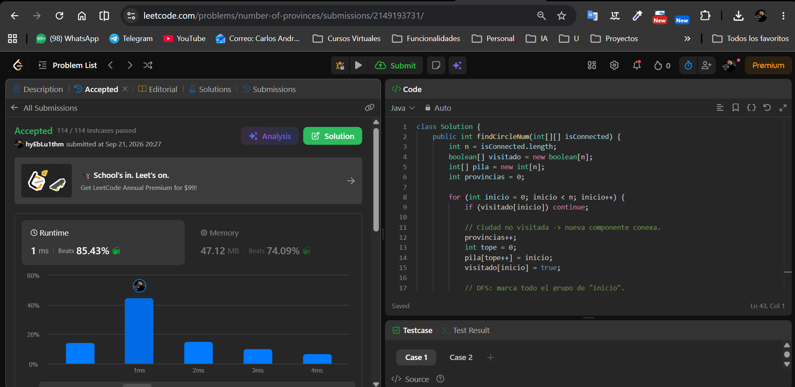
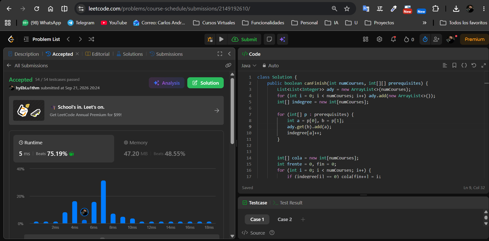

# Tarea 3 · Grafos en LeetCode

Curso: Análisis de algoritmos · ITM · 2026-2
Tema: grafos (recorrido, componentes conexas, grafos dirigidos)

Usuario de LeetCode: **`<hyEbLu1thm>`**

Lenguaje: Java.

---

## 547. Number of Provinces

- Problema: https://leetcode.com/problems/number-of-provinces/
- Código: [`number-of-provinces/Solution.java`](number-of-provinces/Solution.java)

**Modelo:** grafo **no dirigido**. Vértice = ciudad (`0 … n-1`). Arista `{i, j}`
si `i ≠ j` e `isConnected[i][j] == 1`; la matriz es simétrica porque la
conexión es recíproca. La diagonal `isConnected[i][i] = 1` no es una arista
hacia otra ciudad. Una **provincia** es una **componente conexa**: el mismo
problema que contar grupos de amigos.

**Algoritmo: DFS para contar componentes conexas.** Se recorren las ciudades
en orden; cada vez que aparece una ciudad **no visitada** se suma 1 al
recuento y se lanza un DFS (con pila explícita) desde ella, que marca como
visitadas todas las ciudades alcanzables de forma directa o indirecta. Esas
ciudades ya no inician un recuento, así que cada componente se cuenta
exactamente una vez. Una ciudad sin conexiones forma una provincia de tamaño 1.

**Complejidad** (`n` = número de ciudades):
- Tiempo: `Θ(n²)` — la entrada es una matriz de adyacencia; cada ciudad sale
  de la pila una sola vez y al sacarla se recorre su fila completa
  (`n` celdas). Sobre una lista de adyacencia el DFS sería `Θ(n + m)`, pero
  aquí leer la matriz ya cuesta `Θ(n²)`.
- Espacio: `O(n)` adicional — arreglo `visitado[]` + pila (a lo sumo `n`
  ciudades).



---

## 207. Course Schedule

- Problema: https://leetcode.com/problems/course-schedule/
- Código: [`course-schedule/Solution.java`](course-schedule/Solution.java)

**Modelo:** grafo **dirigido** (el pensum). Vértice = materia
(`0 … numCourses-1`). Por cada par `[a, b]` hay un arco **`b → a`** («hay que
cursar `b` antes que `a`»). Se pueden cursar todas las materias **si y solo si
el grafo es un DAG**: un ciclo de prerrequisitos deja bloqueadas a todas sus
materias, porque ninguna puede ser la primera.

**Algoritmo: orden topológico de Kahn (BFS por grados de entrada).**
1. Se construye la lista de adyacencia y el arreglo `indegree[]` (número de
   prerrequisitos pendientes de cada materia).
2. Se encolan las materias con `indegree == 0`, incluidas las aisladas.
3. Se «cursa» la materia del frente: se cuenta y se baja en 1 el `indegree`
   de cada materia que dependía de ella; la que llega a 0 se encola.
4. Si al final se cursaron `numCourses` materias, el grafo es un DAG →
   `true`. Si se cursaron menos, las restantes nunca llegaron a indegree 0
   porque dependen de un ciclo → `false`.

En el mismo archivo se deja, para comparar, la alternativa **DFS de 3
colores** (blanco / gris / negro: llegar a un nodo gris es un arco hacia atrás,
es decir, un ciclo). La versión enviada a LeetCode es la de Kahn.

**Complejidad** (`n = numCourses`, `m = prerequisites.length`):
- Tiempo: `O(n + m)` — construir el grafo recorre los `m` pares; cada materia
  entra y sale de la cola a lo sumo una vez (`n`) y cada arco se recorre una
  sola vez al bajar un indegree (`m`).
- Espacio: `O(n + m)` — listas de adyacencia (`n` listas con `m` arcos en
  total) + `indegree[]` + cola.



---

## Estructura del repositorio

```
tarea3/
├── README.md
├── number-of-provinces/
│   └── Solution.java
├── course-schedule/
│   └── Solution.java
└── evidencias/
    ├── number-of-provinces-accepted.png
    └── course-schedule-accepted.png
```
