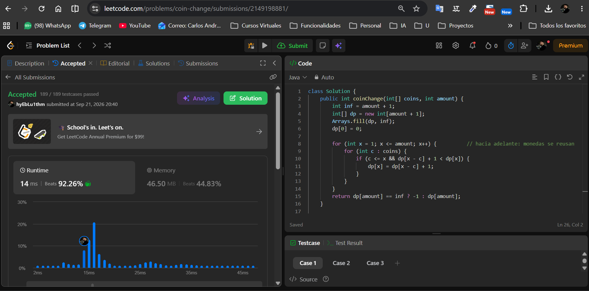
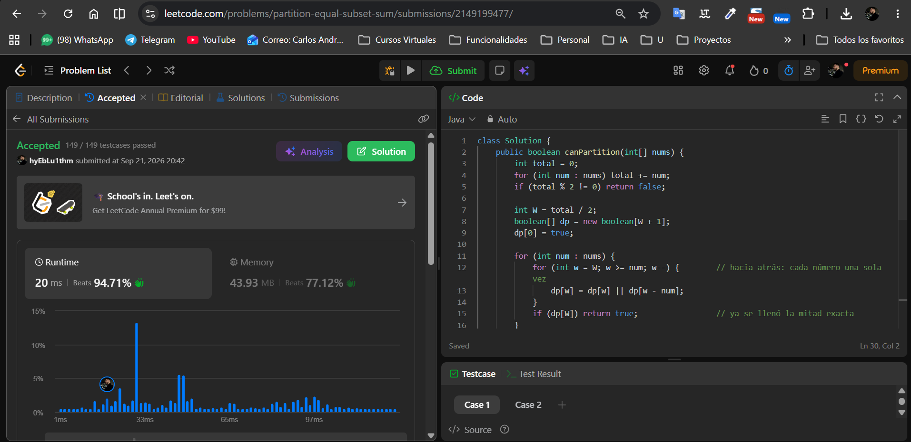

# Tarea 4 · Programación dinámica en LeetCode

Curso: Análisis de algoritmos · ITM · 2026-2
Tema: programación dinámica (mochila no acotada · mochila 0/1)

Usuario de LeetCode: **`<hyEbLu1thm>`**

Lenguaje: Java.

---

## 322. Coin Change

- Problema: https://leetcode.com/problems/coin-change/
- Código: [`coin-change/Solution.java`](coin-change/Solution.java)

**Estado:** `dp[x]` = mínimo número de monedas que suman **exactamente** `x`.
Si `x` todavía no se puede armar, vale `INF = amount + 1` (ninguna solución
real usa más de `amount` monedas).

**Caso base:** `dp[0] = 0` (el monto 0 se arma con cero monedas).

**Recurrencia:** para cada `x` de `1` a `amount`:

```text
dp[x] = min { 1 + dp[x − c] : c ∈ coins, c ≤ x }
```

La última moneda que se pone es `c`, y el resto `x − c` se arma de la mejor
forma, que ya está calculada porque `x − c < x`. Al final, si `dp[amount]`
sigue en `INF` la respuesta es `-1`.

**Reuso → mochila no acotada:** hay infinitas monedas de cada tipo, así que
el monto se recorre **hacia adelante** (`x = 1 … amount`). `dp[x − c]` puede
contener ya la misma moneda `c`, y está bien que se vuelva a usar.

**Por qué no greedy:** con `{1, 3, 4}` y monto `6`, «siempre la más grande»
toma `4 + 1 + 1` = 3 monedas; la DP encuentra `3 + 3` = 2. El sistema no es
canónico, así que tomar la mayor denominación no garantiza el óptimo.

**Complejidad** (`k = coins.length`, `X = amount`):
- Tiempo: `Θ(k · X)`: `X` estados × `k` transiciones cada uno.
  Es **pseudo-polinomial**: depende del valor de `amount`, no de su tamaño
  en bits.
- Espacio: `Θ(X)`: el arreglo `dp` de tamaño `X + 1`.



---

## 416. Partition Equal Subset Sum

- Problema: https://leetcode.com/problems/partition-equal-subset-sum/
- Código: [`partition-equal-subset-sum/Solution.java`](partition-equal-subset-sum/Solution.java)

**Reducción:** sea `S` la suma total. Si `S` es impar, es imposible → `false`.
Si es par, basta con decidir si algún subconjunto suma **exactamente**
`W = S / 2`. Los números que quedan fuera forman la otra mitad, que también
suma `W`. Es la mochila 0/1 con peso = valor.

**Estado:** `dp[w]` = `true` si existe un subconjunto de los números ya
considerados cuya suma es exactamente `w`.

**Caso base:** `dp[0] = true` (el subconjunto vacío suma 0); el resto empieza
en `false`.

**Recurrencia:** al considerar el número `num`, para `w ≥ num`:

```text
dp[w] = dp[w]  OR  dp[w − num]
```

O `w` ya se armaba sin `num`, o se arma `w − num` sin `num` y se le agrega.

**A lo más una vez → mochila 0/1:** con el arreglo 1D, `w` se recorre de
`W` **hacia 0**. Así, cuando se lee `dp[w − num]` (que está más a la
izquierda), todavía tiene el valor **anterior** a considerar `num`. Si se
recorriera hacia adelante, `dp[w − num]` ya podría incluir `num` y el mismo
número se usaría varias veces. Eso convertiría el problema en la mochila no
acotada del ejercicio 1. Ejemplo: con `[2, 2, 3, 5]` (`W = 6`) el recorrido
hacia adelante respondería `true` usando `3 + 3`, cuando la respuesta
correcta es `false`.

**Por qué no fuerza bruta:** enumerar los `2^n` subconjuntos con `n` hasta
200 no corre. La tabla tiene solo `W + 1` estados y se actualiza `n` veces.

**Complejidad** (`n = nums.length`, `W = S / 2`):
- Tiempo: `Θ(n · W)`: `n` números × hasta `W` capacidades cada uno.
  Pseudo-polinomial en `W` (con las cotas de LeetCode, `W ≤ 10 000`).
- Espacio: `Θ(W)`: arreglo 1D de tamaño `W + 1` en lugar de la matriz
  `n × W`, porque cada fila solo depende de la anterior.



---

## Resumen: reuso vs. 0/1

| | Coin Change | Partition Equal Subset Sum |
| --- | --- | --- |
| Tipo de mochila | No acotada (monedas infinitas) | 0/1 (cada número una vez) |
| Recorrido de la capacidad | `x = 1 → amount` (adelante) | `w = W → num` (atrás) |
| Por qué | `dp[x − c]` **puede** incluir ya a `c` | `dp[w − num]` **no debe** incluir a `num` |
